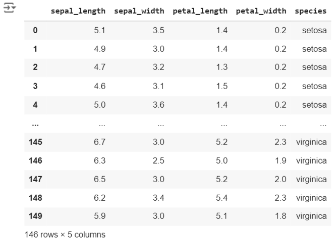

# Exno:1
Data Cleaning Process

# AIM
To read the given data and perform data cleaning and save the cleaned data to a file.

# Explanation
Data cleaning is the process of preparing data for analysis by removing or modifying data that is incorrect ,incompleted , irrelevant , duplicated or improperly formatted. Data cleaning is not simply about erasing data ,but rather finding a way to maximize datasets accuracy without necessarily deleting the information.

# Algorithm
STEP 1: Read the given Data

STEP 2: Get the information about the data

STEP 3: Remove the null values from the data

STEP 4: Save the Clean data to the file

STEP 5: Remove outliers using IQR

STEP 6: Use zscore of to remove outliers

# Coding and Output
# Data Cleaning

import pandas as pd
df=pd.read_csv("SAMPLEIDS.csv")
df

df.isnull().sum()

df.isnull().any()

df.dropna()

df.fillna(0)

df.fillna(method = 'ffill')

df_dropped = df.dropna()
df_dropped

import pandas as pd

ir=pd.read_csv('iris.csv')
ir

ir.describe()

sns.boxplot(x='sepal_width',data=ir)

c1=ir.sepal_width.quantile(0.25)
c3=ir.sepal_width.quantile(0.75)
iq=c3-c1
c3

rid=ir[((ir.sepal_width<(c1-1.5*iq))|(ir.sepal_width>(c3+1.5*iq)))]
rid['sepal_width']

delid=ir[~((ir.sepal_width<(c1-1.5*iq))|(ir.sepal_width>(c3+1.5*iq)))]
delid

sns.boxplot(x='sepal_width',data=delid)

import matplotlib.pyplot as plt
import pandas as pd
import numpy as np
import scipy.stats as stats
dataset=pd.read_csv("heights.csv")
dataset

df = pd.read_csv("heights.csv")
q1 = df['height'].quantile(0.25)
q2 = df['height'].quantile(0.5)
q3 = df['height'].quantile(0.75)
iqr = q3-q1
iqr

low = q1 - 1.5*iqr
low

high = q3 + 1.5*iqr
high

z = np.abs(stats.zscore(df['height']))
z

df1 = df[z<3]
df1

# Result
           Thus we have cleaned the data and removed the outliers by detection using IQR and Z-score method.
